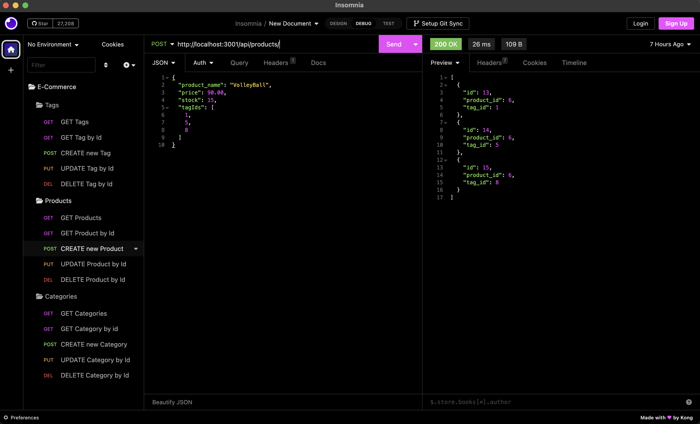
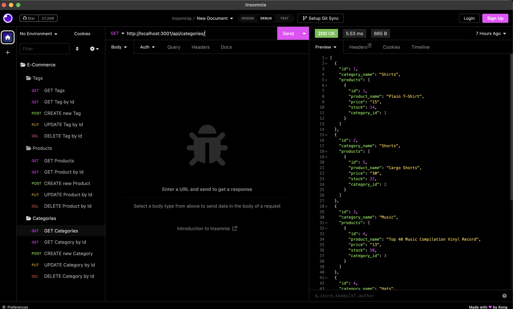

# E-Commerce Database 

## Description

This is a mock e-commerce database to apply for any future projects involing displying products that have multiple tags. They can be categorized using the category tables

# Table of Contents

[Description](#description)

[How to Install](#install)

[How to Use](#usage)

[How to contribute](#contribute)

[How to Test](#test)

[License](#license)

[Contact Me](#contact)

## Installation

To install:

    1) clone down from this repo
    2) Open the schema file and copy the provided code into sql workbench or run it it  your mysql shell to built the recommanded db
    3) run the command, "npm i" to install required remote models
    4) run the command, "npm run seed"
    5) Finally, run the command, "npm start" to start the server

## Usage

Its recommend that you use the free [Insomnia](https://insomnia.rest/) to test the diffrent routes built to POST, UPDATE, and DELETE the tags, cateigories, and products for the site.

[Walkthrough Viedo](https://drive.google.com/file/d/1bEKhmOqiutVYsC3bJVrUvtYRCTanwLH5/view)

Follow this image to POST a new Product thorugh Insomnia:

## Contributing

If you would like to contribute to this project, please reach out to me via email!

## Tests

There is a script to use the seeded data to test the routes through a thrid party api testers like [Insomnia](https://insomnia.rest/). If one of these routes aren't working properly please check the server error that is returned. It should give a detailed breakdown following the error. For mac users, please check the the config directory and open the connection file. Change the host value, "127.0.0.1" to connect to the proper server.

The following image is what should be expected when sending a GET request to categories:

## License

This project is licensed under the MIT license.
See [LICENSE](https://www.mit.edu/~amini/LICENSE.md) for more information!

## Question

If you have any questions or concerns about this project please contact me!

My gitHub account is: MMount98

Link to my [gitHub](https://github.com/MMount98) Account

You can always reach out via my email: Mount.photos@gmail.com
